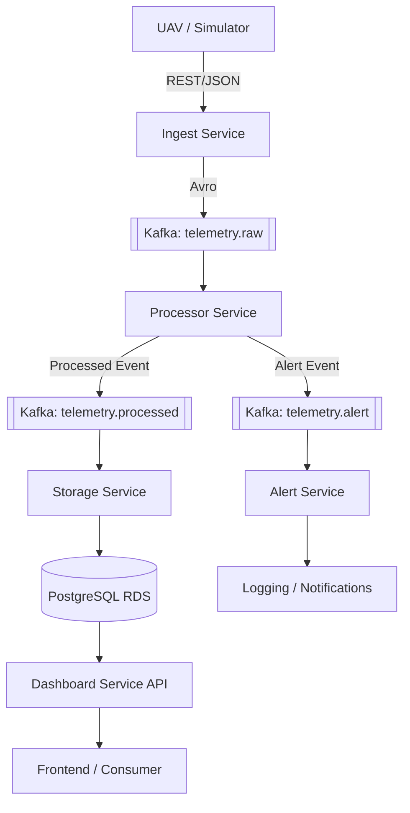

# UAV Telemetry Ingestion & Processing System

A distributed, event-driven microservices architecture designed for real-time monitoring, processing, and alerting of Unmanned Aerial Vehicle (UAV) telemetry data.

---

##  System Architecture

The system follows a reactive, event-driven pattern using **Apache Kafka** as the central nervous system.

---

## Business Logic & Microservices

### 1. Ingest Service (Entry Point)
*   **Role**: Validates incoming telemetry packets from UAVs.
*   **Logic**: Enforces schema integrity using `jakarta.validation`. It adds ingestion metadata and converts raw JSON/Protobuf into **Apache Avro** format for downstream efficiency.
*   **Constraint**: Contains no business logic to ensure maximum throughput and low latency.

### 2. Processor Service (The Brain)
*   **Role**: Executes core domain logic and anomaly detection.
*   **Logic**:
    *   **Validation**: Re-validates coordinate ranges and ID formats.
    *   **Anomaly Detection**: Monitors battery voltage (triggers alert if < 20V) and checks drone `failsafe` status.
    *   **Transformation**: Enriches raw data with `processingTime` and calculated metrics before publishing to the processed stream.

### 3. Storage Service (Persistence)
*   **Role**: Consumes the processed event stream.
*   **Logic**: Maps Avro records to JPA Entities. It uses a specialized flat schema to store complex nested telemetry (GPS, Attitude, Battery) into queryable PostgreSQL tables for historical analysis.

### 4. Dashboard Service (API)
*   **Role**: Serves data to end-users.
*   **Logic**: Provides paginated historical telemetry and specialized "Flight Replay" endpoints that return chronologically ordered data points for path visualization.

### 5. Alert Service (Monitoring)
*   **Role**: Reactive notification handler.
*   **Logic**: Listens specifically to the `telemetry.alert` topic. Currently logs high-severity anomalies, structured for future integration with WebSocket push or SMS/Email gateways.

---

## Autonomous Deployment (CI/CD)

The project is designed for **"No-Ops" deployment** on AWS using a split-lifecycle strategy managed by GitHub Actions.

### Infrastructure-as-Code (Terraform)
*   **Compute**: Amazon EKS (Kubernetes).
*   **Messaging**: Self-hosted Kafka cluster on EC2
*   **Database**: Managed Amazon RDS for PostgreSQL.
*   **State Management**: Terraform state is stored in a remote **S3 Bucket** with versioning to allow collaborative management via GitHub.

### Deployment Pipeline
1.  **Infrastructure Lifecycle**: A dedicated workflow (`terraform-apply.yml`) provisions the VPC, EKS, and Databases.
2.  **App Lifecycle**: Every `git push` to `main` triggers an autonomous build:
    *   **Compile**: Java 25 microservices are built via Gradle.
    *   **Containerize**: Docker images are built using multi-stage `Dockerfile`s and pushed to **Amazon ECR**.
    *   **Sync**: The workflow fetches dynamic outputs from Terraform (Kafka IPs, RDS Endpoints) and injects them into Kubernetes Manifests.
    *   **Deploy**: `kubectl` updates the EKS cluster with zero downtime.

---

## Tech Stack
*   **Backend**: Java 25, Spring Boot 3.x/4.x
*   **Messaging**: Apache Kafka, Apache Avro
*   **Infrastructure**: AWS (EKS, RDS, EC2, ECR, S3)
*   **Provisioning**: Terraform
*   **Automation**: GitHub Actions
*   **Database**: PostgreSQL
